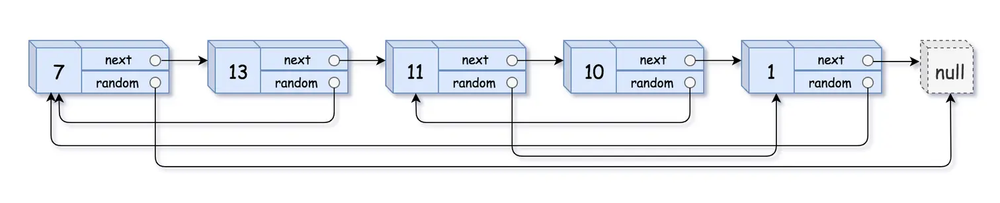

# 复制带随机指针的链表
**关键字：链表、哈希表**
```md
题目描述：给定一个链表，每个节点包含一个额外增加的随机指针，该指针可以指向链表中的任何节点或空节点。要求返回这个链表的 深拷贝。
我们用一个由 n 个节点组成的链表来表示输入/输出中的链表。每个节点用一个 [val, random_index] 表示：
val：一个表示 Node.val 的整数。
random_index：随机指针指向的节点索引（范围从 0 到 n-1）；如果不指向任何节点，则为  null 。
```
示例1：

```md
输入：head = [[7,null],[13,0],[11,4],[10,2],[1,0]]
输出：[[7,null],[13,0],[11,4],[10,2],[1,0]]
```
示例2:

```md
输入：head = [[1,1],[2,1]]
输出：[[1,1],[2,1]]
```
示例3:

```md
输入：head = [[3,null],[3,0],[3,null]]
输出：[[3,null],[3,0],[3,null]]
```
示例4:
```md
输入：head = []
输出：[]
解释：给定的链表为空（空指针），因此返回 null。
```

## 思路分析
1. `深拷贝` 需要单独开辟空间来存储引用数据，而不是直接拷贝其引用
2. `节点的拷贝` 除了`next`指针还有`random`指针，可能存在重复的指向，推荐使用`Map`哈希存储`[旧节点，新节点/拷贝节点]`
3. `两次遍历`

### 两次遍历
   - `第一次遍历` 遍历链表，创建拷贝/新节点，拷贝节点值，并用`map`存储`[旧节点，新节点/拷贝节点]` -- 只是拷贝单个节点值，而不处理连接关系
   - `第二次遍历` 遍历链表，根据当前的`旧节点、旧next节点、旧random节点`，通过`map`获取对应的新节点，并处理新节点的`next 和 random 索引`

::: details 展开查看代码
<<< @/algorithm/RealQuestions/ts/CopyRandomList.ts
:::