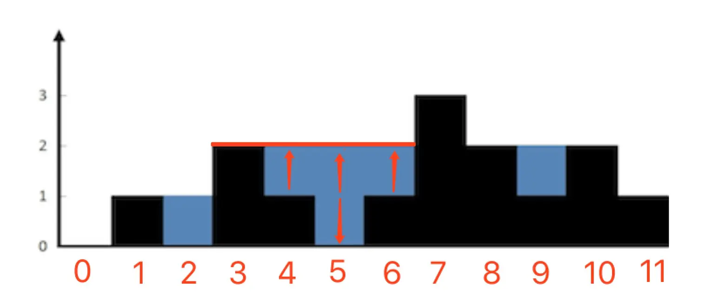
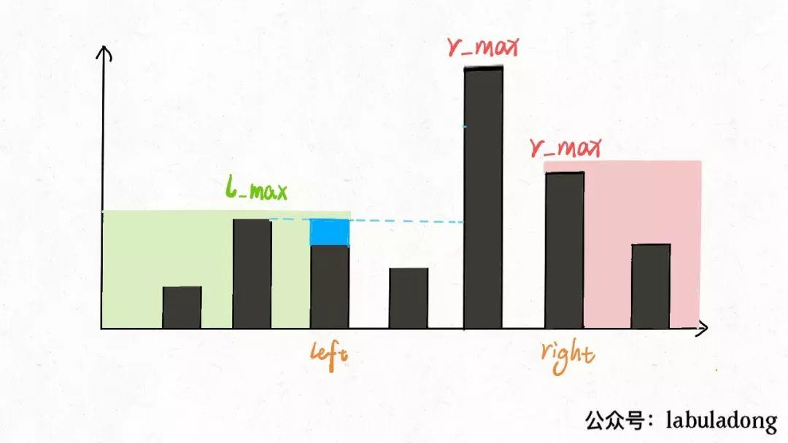

# 接雨水问题
**关键字：数组、双指针、单调栈**
```
题目描述：给定 n 个非负整数表示每个宽度为 1 的柱子的高度图，计算按此排列的柱子，下雨之后能接多少雨水
```
```
示例：
输入: [0,1,0,2,1,0,1,3,2,1,2,1]
输出: 6
```


## 思路分析
将给定的柱子按顺序排列起来，接雨水

**1. 有凹槽才能接雨水**
   
必须两端都有有高度的柱子, 那么第一个柱子和最后一个柱子无法接雨水

**2. 接多少雨水**

以`2`为例，其左右分别`1`和`3`, 雨水量为较短的柱子`1`的高度`1`

以`9`为例，其左右分别为`8`和`9`, 雨水量为较短的柱子`8或10`的高度 - `9`的高度：`2 - 1 = 1`

以`4-6`为例，其左右分别为`3`和`7`, 并不紧紧相邻，`4`的雨水量为`Math.min(左侧最大柱子高度, 右侧最大柱子高度) - 当前柱子高度`

由上述三个例子可知，凹槽的高度不是取决于其紧邻左右的柱子的高度，而是取决于**其左侧最高的柱子 和 右侧最高的柱子中的较矮的柱子**, 雨水不能超过这个高度，否则会溢出，所以雨水量就为**雨水上限 - 雨水底部(当前凹槽柱子的高度)**

### 暴力遍历法
遍历到一个柱子，再向两侧去遍历查找其左右两侧的最高柱子(最高-需要遍历完)，再来比对计算雨水量，只有两侧的最高柱子都比当前柱子高时，才能形成凹槽，承接雨水

### 备忘录优化
在暴力遍历法中，内层遍历中每个柱子都会去找其左右的最高柱子，这个过程可能会重复，使用数组先遍历存储起来

1. 从左往右遍历，将每个元素的左侧最高柱子存储，每次与前一个元素的最高柱子比对即可
2. 从右往左遍历，将每个元素的右侧最高柱子存储，每次与后一个元素的最高柱子比对即可
3. 从头遍历，按照`Math.min(左侧最大柱子高度, 右侧最大柱子高度) - 当前柱子高度`来累计计算雨水量

### 双指针法-对撞指针
#### 定义
一左一右两个指针，向中间聚拢，边走边算

定义两个指针`left`和`right`，同时维护两个左右的最大值`l_max`和`r_max`, 两个指针从`两端向中间`靠拢，然后更新计算最大值和雨水量

**l_max是(0-left)的最大值，r_max是(right, end)的最大值**，left与right中间可能还存在柱子

`l_max一定是left左侧最大值，r_max不一定是left右侧最大值`

`r_max一定是right右侧最大值，l_max不一定是right左侧最大值`

#### 解析
以下图为例，当`l_max < r_max`时

**1. 假如计算`left`的雨水量**

因为`l_max < r_max`， 所以`Math.min(left左侧最大值=l_max, left右侧最大值 >= r_max)`一定取l_max，与r_max无关

**2. 假如计算`right`的雨水量**

right左侧最大值可能大于l_max -> 上限无法确定 -> 可能大于r_max，也可能小于r_max

`Math.min(right左侧最大值-unknown, right右侧最大值=r_max)`中right左侧值大小不确定，无法判断right左右两侧最大柱子的较矮高度

**综上所述，当`l_max < r_max`时，可以计算left的雨水量，反之计算right的雨水量**

#### 解题步骤
1. 定义两端双指针`left`和`right`，`l_max`-left左侧的最大值，`r_max`-right右侧的最大值
2. 当`l_max < r_max`时，更新`l_max`并计算left的雨水量，`left`指针右移
3. 当`l_max >= r_max`时，更新`r_max`并计算right的雨水量，`right`指针左移
4. `left>right`时，遍历计算完成




---
[参考解析1](https://www.cxyxiaowu.com/2759.html)

[参考解析2](https://programmercarl.com/0042.%E6%8E%A5%E9%9B%A8%E6%B0%B4.html#%E5%85%B6%E4%BB%96%E8%AF%AD%E8%A8%80%E7%89%88%E6%9C%AC)
